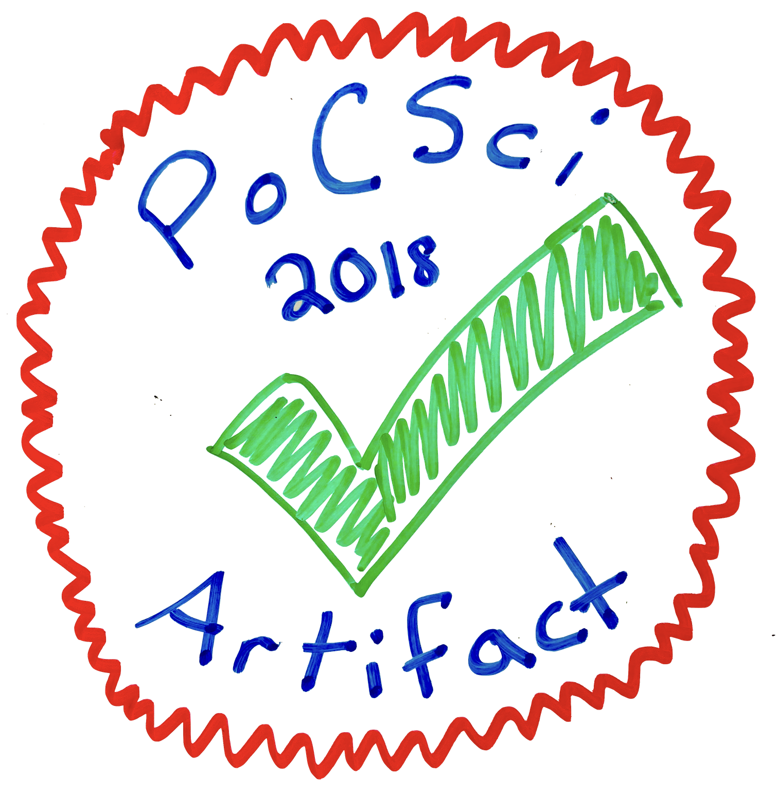

# ACRONYM

You know what makes good research? A good name. Let this script take care of
that for you.

Presented at PoCSci 2018.

Searches the CS arXiv for acronyms to seed the generator, then generates the
acronym of your choice. You can initiate the search with keywords and also
search through the found acronyms to see if your name has already been taken.

Be nice to the arXiv.
